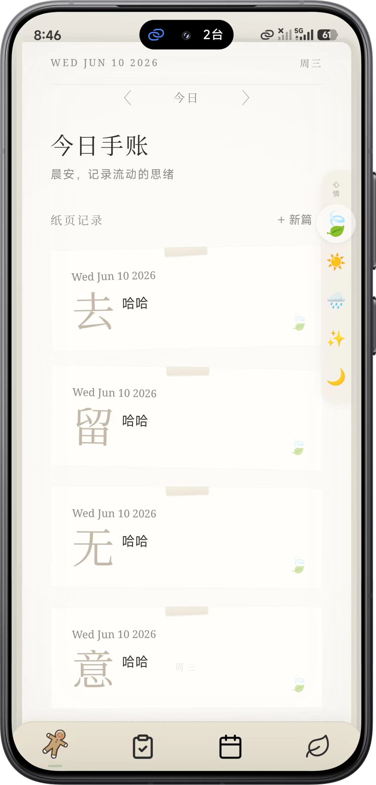
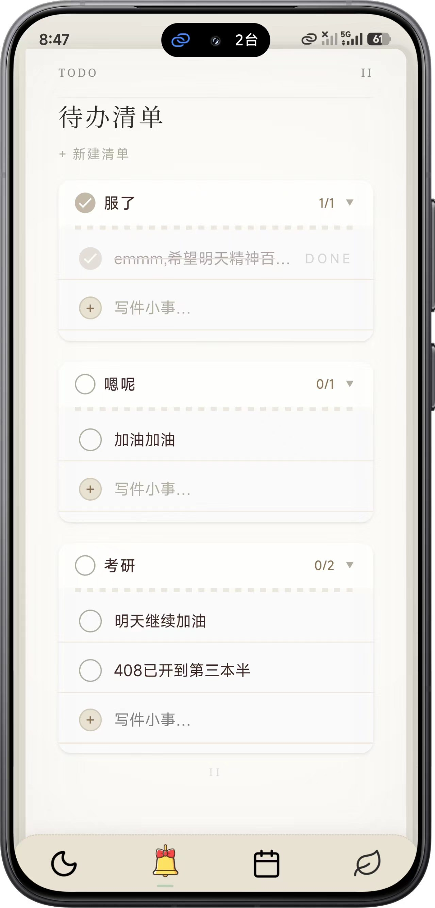
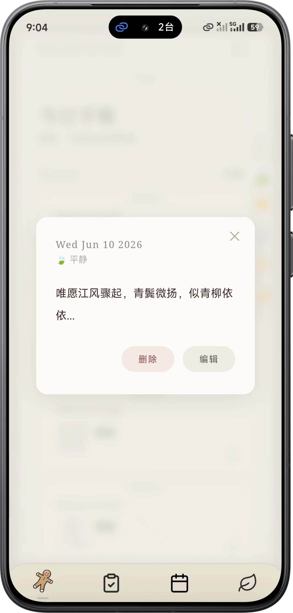
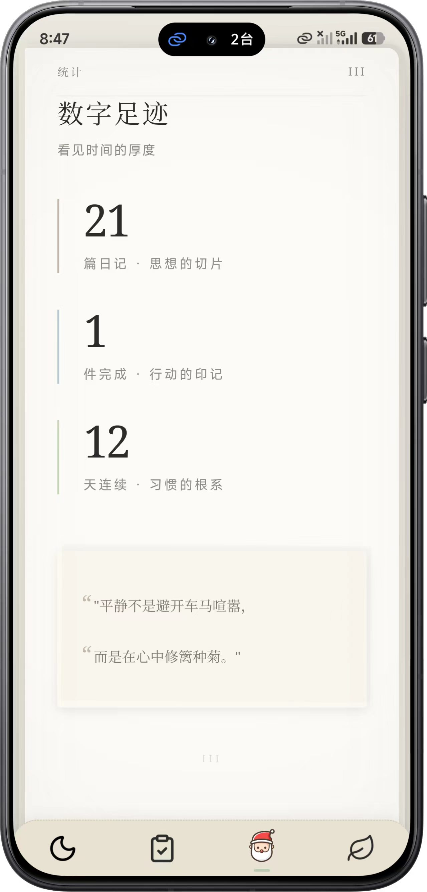
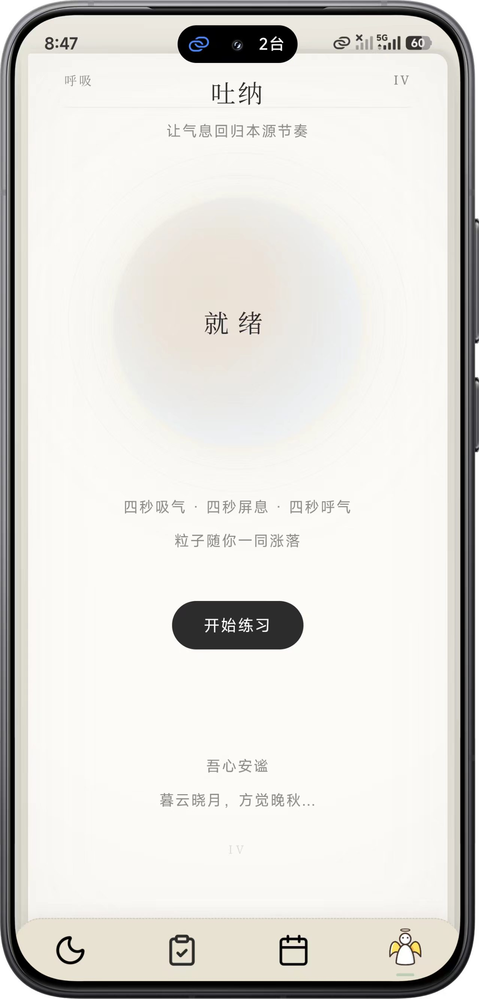

# FlowJournal 心流手账

> 一本流动的手账，记录思绪的涟漪。离线优先，纸墨质感。

基于 uni-app Vue 3 构建的离线日记/手账应用，采用宣纸暖色调设计，支持原生 SQLite 持久化与 H5 内存降级。四页手账式布局，配合 3D 翻页动画、粒子系统与呼吸练习，营造沉浸书写体验。

---

## 项目展示

<p align="center">
  
  
  
</p>
<p align="center">
  
  
</p>

---

## 功能亮点

| 功能模块 | 功能说明 |
|----------|----------|
| **日记书写** | 底部抽屉式 ComposeSheet 快速记事，支持情绪标签选择 |
| **滑动交互** | 左滑归档（30% 阈值）→ 继续左滑删除（50% 阈值），操作直觉化 |
| **待办管理** | 动态分组、进度环、批量切换、DONE 印章动画 |
| **数据足迹** | 统计页数字滚动动画，记录连续书写天数 |
| **呼吸练习** | 12 秒吐纳周期（4s 吸 / 4s 屏 / 4s 呼），60 粒子画布联动 |
| **全局粒子** | BreathParticle + DustParticle 双层粒子系统，覆盖所有页面 |
| **情绪书签** | 侧边栏五种情绪标签，一键标记当日心境 |
| **自定义导航** | NavSpine 替代原生 tabBar，书签式标签栏 + 英文图标文件名 |
| **3D 翻页** | CSS @keyframes 翻页动画（flipInNext / flipInPrev，1.0s），模拟实体书翻页 |
| **离线存储** | App 端 plus.sqlite 持久化 / H5 端内存降级，零网络依赖 |

---

## 项目结构

```
flowjournal/
├── src/
│   ├── App.vue                    # 全局入口，粒子层 + 书壳背景
│   ├── main.js                    # 应用启动
│   ├── pages.json                 # 路由配置（4 页，自定义导航）
│   ├── manifest.json              # uni-app 应用清单
│   ├── uni.scss                   # 全局 SCSS 变量
│   │
│   ├── common/
│   │   └── db.js                  # FlowDB 类（Promise API，条件编译）
│   │
│   ├── utils/
│   │   └── swipeNav.js            # useSwipeNav 滑动翻页 composable
│   │
│   ├── components/
│   │   ├── BookPage.vue           # 书页容器（翻页动画 + 页眉页脚）
│   │   ├── DiaryCard.vue          # 日记卡片（滑动归档/删除）
│   │   ├── ComposeSheet.vue       # 底部抽屉式书写面板
│   │   ├── FabButton.vue          # 悬浮新建按钮
│   │   ├── TodoSwipe.vue          # 待办滑动条（勾选/删除）
│   │   ├── MoodMark.vue           # 情绪书签侧边栏
│   │   ├── BreathOrb.vue          # 呼吸球（收缩/膨胀动画）
│   │   ├── ParticleCanvas.vue     # 全局粒子画布（Canvas 2D）
│   │   └── NavSpine.vue           # 自定义 tabBar 导航
│   │
│   ├── pages/
│   │   ├── home/index.vue         # 手账首页（日记列表）
│   │   ├── todos/index.vue        # 待办管理（分组 + 进度环）
│   │   ├── stats/index.vue        # 数据统计（数字动画）
│   │   └── breathe/index.vue      # 呼吸练习（粒子联动）
│   │
│   └── static/
│       ├── fonts/                 # Noto Serif SC（Light/Regular/SemiBold .ttf）
│       ├── label/                 # 情绪图标（leaves/moon/star/sun/water_drop .png）
│       └── tabbar/                # 导航图标（8 个：handbook/todo/stats/breathe + active）
│
├── show_image/                    # 项目展示截图
├── package.json
├── vite.config.js
└── index.html
```

---

## 快速开始

### 环境要求

- **Node.js** >= 18
- **npm** >= 9（或 pnpm / yarn）
- **HBuilderX**（推荐，用于 App 真机调试与云打包）

### 安装与运行

```bash
# 克隆仓库
git clone https://github.com/WhisperCove/flowjournal.git
cd flowjournal

# 安装依赖
npm install

# H5 开发模式（浏览器预览）
npm run dev

# 微信小程序
npm run dev:mp-weixin
```

### HBuilderX 真机调试

1. 用 HBuilderX 打开项目根目录
2. 菜单：**运行 → 运行到手机或模拟器 → 选择设备**
3. 首次运行会自动安装依赖并编译

### 构建发布

```bash
# H5 生产构建
npm run build:h5

# 微信小程序构建
npm run build:mp-weixin
```

---

## 技术栈

| 分类 | 技术 | 版本 |
|------|------|------|
| 框架 | uni-app + Vue 3 Composition API | 3.0.0-50007 |
| 语言 | JavaScript（script setup） | ES2022 |
| 样式 | SCSS + CSS @keyframes | - |
| 构建 | Vite | 5.2.8 |
| 数据库 | plus.sqlite（App）/ 内存存储（H5） | - |
| 字体 | Noto Serif SC（思源宋体） | TTF |

---

## 设计语言

FlowJournal 追求"纸墨温度"，视觉风格介于实体手账与数字界面之间：

| 元素 | 规范 |
|------|------|
| 主背景 | `#FDFCF8`（暖宣纸色） |
| 书壳背景 | `#E8E4DC`（老纸灰调） |
| 正文字色 | `#2C2C2C`（墨色） |
| 辅助色 | `#B8A88A`（旧纸黄棕） |
| 正文字体 | Noto Serif SC（思源宋体） |
| 圆角 | 8px ~ 16px（柔和手感） |
| 阴影 | 多层扩散阴影，模拟纸张叠放 |
| 动效 | 3D 翻页 + 墨滴粒子 + 呼吸脉动 |

### 设计原则

- **手绘感**：图标与装饰元素避免硬边几何，保留手作温度
- **留白**：大量呼吸空间，不让信息压迫视线
- **层次**：书壳 → 书页 → 卡片三层视觉纵深
- **触觉**：滑动、点击、长按均有视觉反馈

---

## 平台兼容

| 平台 | 状态 | 存储方案 | 备注 |
|------|------|----------|------|
| H5（浏览器） | 完整支持 | 内存存储（刷新丢失） | 开发调试首选 |
| App（Android） | 完整支持 | plus.sqlite 持久化 | 推荐发布平台 |
| App（iOS） | 完整支持 | plus.sqlite 持久化 | 需 Xcode 签名 |
| 微信小程序 | 基础支持 | 内存存储 | 部分 API 受限 |

### 平台适配注意事项

- **requestAnimationFrame**：App 端已替换为 `setTimeout` 兼容
- **performance API**：App 端已替换为 `Date.now()` 兼容
- **SVG 图标**：App 端可能不渲染，已改用文本/emoji 替代
- **localStorage / IndexedDB**：App 端不可用，统一走 `plus.sqlite`

---

## 数据库架构

FlowJournal 采用双存储策略，确保跨平台数据一致性：

### App 端（plus.sqlite）

```sql
-- 日记表
CREATE TABLE IF NOT EXISTS diaries (
  id INTEGER PRIMARY KEY AUTOINCREMENT,
  text TEXT NOT NULL,
  mood TEXT DEFAULT '🍃',
  date TEXT,
  fullDate TEXT,
  timestamp INTEGER
);

-- 待办表
CREATE TABLE IF NOT EXISTS todos (
  id INTEGER PRIMARY KEY AUTOINCREMENT,
  text TEXT NOT NULL,
  completed INTEGER DEFAULT 0,
  categoryId TEXT DEFAULT 'default',
  sortIndex INTEGER DEFAULT 0,
  createdAt INTEGER
);
```

### H5 端（内存存储）

当 plus.sqlite 不可用时，自动降级为内存存储，保证功能完整性。

---

## 组件架构

### 核心组件

| 组件 | 职责 | 关键特性 |
|------|------|----------|
| `BookPage.vue` | 书页容器 | 翻页动画、页眉页脚、书壳背景 |
| `DiaryCard.vue` | 日记卡片 | 滑动归档/删除、情绪标签、日期显示 |
| `ComposeSheet.vue` | 书写面板 | 底部抽屉式、情绪选择、墨滴粒子 |
| `MoodMark.vue` | 情绪书签 | 侧边栏、五种情绪、一键标记 |
| `ParticleCanvas.vue` | 粒子系统 | 双层粒子、呼吸联动、全局覆盖 |
| `NavSpine.vue` | 导航组件 | 书签式标签栏、自定义样式 |

### 数据流

```
用户操作 → ComposeSheet → FlowDB → 页面刷新
    ↓
情绪选择 → MoodMark → 全局状态
    ↓
粒子触发 → ParticleCanvas → 视觉反馈
```

---

## 开发指南

### 代码规范

- 使用 Vue 3 Composition API（script setup）
- 组件命名采用 PascalCase
- 工具函数采用 camelCase
- 样式使用 SCSS，遵循 BEM 命名规范

### 调试技巧

1. **H5 调试**：使用浏览器开发者工具
2. **App 调试**：使用 HBuilderX 真机调试
3. **粒子系统**：调整 `ParticleCanvas.vue` 中的参数
4. **翻页动画**：修改 `BookPage.vue` 中的 CSS @keyframes

### 性能优化

- 粒子系统使用 Canvas 2D 渲染
- 翻页动画使用 CSS transform 硬件加速
- 数据库操作采用异步 Promise API
- 图片资源进行压缩优化

---

## 许可证

[MIT](LICENSE) © WhisperCove

---

> *让思绪流动，让记录成为习惯。*